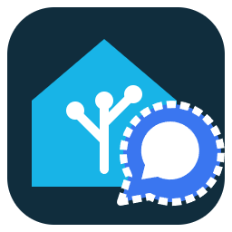

# UGSo CallMeBot Signal

Experimental Home Assistant app **0.1.0**, in the same repository as UGSo CallMeBot Whatsapp and Blocks for HA. Original UGSo implementation inspired by [ioBroker.signal-cmb](https://github.com/derAlff/ioBroker.signal-cmb). No ioBroker runtime required.

DE/EN/FR Ingress UI, recipient profiles with international phone numbers or Signal UUIDs, separate Signal API keys and MQTT namespace. Matching **Signal · CallMeBot** block and profile picker in Blocks for HA **0.1.50**. WhatsApp profiles/keys are not reused.



- [Deutsch](https://opensource.ugso-software.de/projects/callmebot-signal/)
- [English](https://opensource.ugso-software.de/en/projects/callmebot-signal/)
- [Français](https://opensource.ugso-software.de/fr/projects/callmebot-signal/)
- [Setup and protocol in DE/EN/FR](DOCS.md)

## Development

```sh
python -m pip install -r callmebot_signal/requirements.txt
python -m unittest discover -s callmebot_signal/tests -v
node --test callmebot_signal/tests/request-id.test.mjs
docker build -t ugso-callmebot-signal:test callmebot_signal
```

Local preview: set CALLMEBOT_NO_MQTT=1 and CALLMEBOT_PORT=4183; use a temporary CALLMEBOT_DATA directory, then run python callmebot_signal/app/server.py. Browser tests intercept send requests and use dummy keys. No real messages in automated tests.
