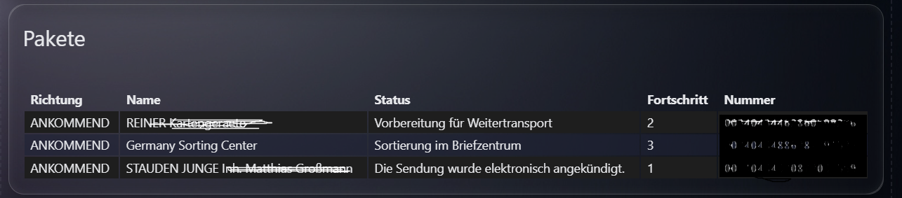

# Parcel to MQTT

Home Assistant app for publishing parcel tracking data through MQTT Discovery.

Adapted from and inspired by the original ioBroker adapter:
[TA2k/ioBroker.parcel](https://github.com/TA2k/ioBroker.parcel)

The shared parcel status model is inspired by the MIT licensed Home Assistant parcel integrations:
[ha-parcel-integrations](https://github.com/ha-parcel-integrations)

## Entities

- `Parcel Verbindung`
- `Parcel letzte Aktualisierung`
- `Parcel Sendungen`
- `Parcel Gesamt`
- `Parcel Unterwegs`
- `Parcel In Zustellung`
- `Parcel Zugestellt`
- `Parcel Problem`
- `Parcel Unbekannt`
- `Parcel 01` through configured parcel slots

Each parcel slot exposes tracking number, carrier, status, last event, last event time and raw status as attributes.

## Configuration

```yaml
dhl:
  enabled: true
  tracking_numbers: "00340434123456789012,00340434123456789013"
  login_url: "https://login.dhl.de/..."
  login_code: ""
hermes:
  enabled: true
  tracking_numbers: "12345678901234"
gls:
  enabled: false
  tracking_numbers: ""
  postal_code: ""
dpd:
  enabled: false
  tracking_numbers: ""
  username: ""
  password: ""
ups:
  enabled: false
  tracking_numbers: ""
  username: ""
  password: ""
amazon:
  enabled: false
  email: ""
  password: ""
  otp_token: ""
deutsche_post:
  enabled: false
  tracking_numbers: ""
fedex:
  enabled: false
  tracking_numbers: ""
general:
  interval: 60
  max_parcels: 6
  log_response_details: false
```

The Home Assistant app options are grouped by provider. These groups are the intended accordion-style settings sections in the app UI.
`dhl.login_url` is a copy helper for the DHL browser login. Open it in Chrome, sign in to DHL, open the developer console with `F12`, copy the failed `dhllogin://...` redirect URL and paste it into `dhl.login_code`.
After the first successful login the app stores the refresh token in `/data/dhl_session.json` and reads the DHL account parcel list automatically.
`dhl.tracking_numbers` and `hermes.tracking_numbers` accept comma-separated lists.
GLS, DPD, UPS, Amazon Logistics, Deutsche Post letters and FedEx are already present as provider sections, but polling is only active for DHL and Hermes until their stable login/session or direct tracking flow is implemented.
`general.log_response_details` writes masked provider requests and responses to the add-on log and `/data/provider_debug.log`. The file keeps at most 100 JSON lines.
Notifications should be created as Home Assistant automations using the generated entities.

## Dashboard example



```yaml
type: custom:flex-table-card
title: Pakete
entities:
  include: sensor.parcel_to_mqtt_parcel_dhl_json
columns:
  - name: Richtung
    data: sendungen
    modify: x.sendungsinfo.sendungsrichtung
  - name: Name
    data: sendungen
    modify: x.sendungsinfo.sendungsname
  - name: Status
    data: sendungen
    modify: x.sendungsdetails.sendungsverlauf.status
  - name: Fortschritt
    data: sendungen
    modify: x.sendungsdetails.sendungsverlauf.fortschritt
  - name: Nummer
    data: sendungen
    modify: x.sendungsdetails.sendungsnummern.sendungsnummer
```

## Provider roadmap

- DHL: active through `dhllogin://` browser login code plus optional manual tracking numbers.
- Amazon: prepared with e-mail, password and optional OTP token.
- Hermes: currently active by manual tracking number; account login with app username and app password is planned.
- UPS: prepared with app username, password and manual tracking numbers.
- GLS: prepared with manual tracking numbers and delivery postal code.
- DPD: prepared with username, password and manual tracking numbers after the stable login/session flow is mapped.
- Deutsche Post letters and FedEx: prepared with manual tracking numbers for later connectors.
